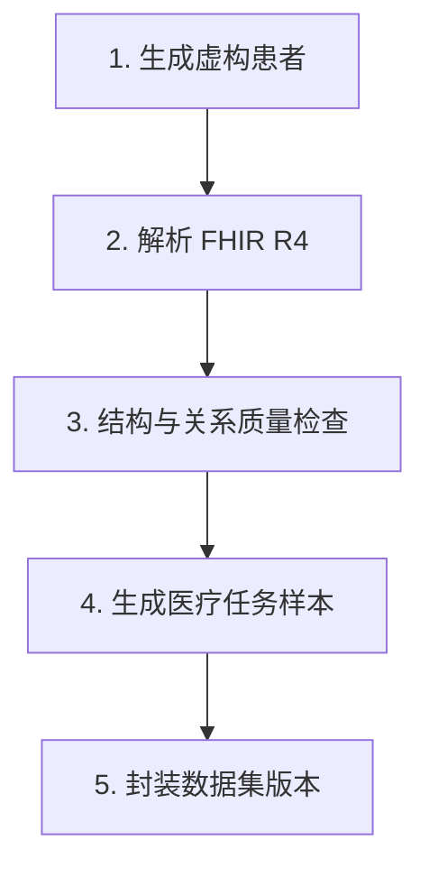

# 医疗数据合成模块说明

这份文档用尽量简单的语言解释项目里的“医疗数据合成模块”到底是什么、解决什么问题、用户如何使用，以及系统内部是怎样一步步把虚构患者变成一个可检查、可追踪的数据集的。

## 一句话理解

这个模块不是医院系统，也不是诊断助手。

它是一个本机运行的“医疗数据实验工厂”：用 Synthea 自动生成完全虚构的患者记录，把记录整理成标准的 FHIR 医疗数据，再检查数据结构和患者之间的引用关系，最后生成带来源证据的医疗任务样本，并保存成一个可发布的数据集版本。

可以把它理解成下面这件事：

```text
按条件制造一批虚构患者
        ↓
生成他们的就诊、疾病、用药等记录
        ↓
检查记录能不能正确读取、相互引用
        ↓
整理成患者时间线
        ↓
根据真实资源统计结果生成任务样本
        ↓
保存质量报告、数据卡、版本和血缘
```

## 当前交付信息

- 网站：`http://127.0.0.1:5174/medical`（当前浏览器实例）
- 默认网站端口：`http://127.0.0.1:5173/medical`
- 当前代码分支：`agent/five-tool-workbench`
- 固定 Synthea commit：`7e08387c68a7f0e21d13076609a159fd473fc902`

网站只绑定本机地址，不能从公网直接访问。

## 1. 它解决什么问题

做医疗数据系统或医疗 AI 实验时，通常需要大量有结构的医疗记录。但是直接使用真实病历会带来隐私、授权、脱敏、数据泄露和合规问题。

这个模块提供一条安全的实验路径：

- 不接收真实患者病历。
- 不把真实病例上传给模型或第三方服务。
- 每次可以用固定参数和固定随机种子重新生成。
- 输出遵循 FHIR 这种常见的医疗数据标准。
- 每条衍生任务都可以追溯到原始医疗资源。
- 数据没有通过质量门禁时，不能发布为数据集版本。

因此，它主要用于：

1. 测试医疗数据导入、解析、转换和导出程序。
2. 测试 FHIR 数据处理流程。
3. 构造医疗问答或信息抽取任务的实验样本。
4. 验证数据平台的流程编排、质量检查、版本和血缘功能。
5. 给后续的模型训练或评估准备一个没有真实隐私风险的起始数据集。

## 2. 它不是什么

这一点非常重要。

这个模块：

- 不是电子病历系统。
- 不接收真实病例。
- 不判断真实患者是否患病。
- 不提供诊断、处方或治疗建议。
- 不代表中国人群、某家医院或真实医疗机构的数据分布。
- 不证明某个模型在真实临床环境中是安全的。
- 不是完整的临床级 FHIR 合规验证器。

它生成的是“适合做数据工程和模型任务研究的虚构数据”。

## 3. 用户实际看到的是什么

用户打开医疗页面后，通常只需要按四步操作：

1. 填写项目名称，设置患者数量、年龄范围、性别和随机种子。
2. 查看不能修改顺序的固定医疗流程。
3. 选择要发布的数据；依赖项由系统自动补齐。
4. 确认“这些是虚构患者”，点击生成，完成后按项目查看数据资产。

每次点击生成都会自动创建一个新的项目 ID、一次流程运行和一个数据集版本，不要求用户填写或选择“已有项目”。

当前默认参数大致是：

```json
{
  "population": 50,
  "seed": 20260814,
  "min_age": 18,
  "max_age": 80,
  "gender": "all",
  "confirmed": true
}
```

含义如下：

| 参数 | 含义 |
|---|---|
| `population` | 要生成多少个虚构患者，当前最多 500 个 |
| `seed` | 随机种子，相同配置可以帮助复现相同结果 |
| `min_age` | 最小年龄 |
| `max_age` | 最大年龄 |
| `gender` | `all`、`M` 或 `F` |
| `confirmed` | 用户是否确认生成虚构患者数据 |

用户不需要自己打开 Java、写 FHIR 解析脚本或执行多条命令。网页把参数提交给 Gateway，Gateway 在后台执行完整流程。

## 4. “医疗数据”在这里到底指什么

Synthea 生成的不是一张简单的患者表，而是一组互相关联的医疗资源。

例如，一个患者可能关联：

```text
Patient
 ├── Encounter           就诊记录
 ├── Condition           疾病或健康问题
 ├── MedicationRequest   用药请求
 ├── Observation         检查或观察结果
 ├── Procedure           医疗操作
 └── DiagnosticReport    检验或诊断报告
```

这些资源通常通过患者 ID 互相联系，例如：

```json
{
  "resourceType": "Encounter",
  "id": "encounter-001",
  "subject": {
    "reference": "Patient/patient-001"
  }
}
```

这表示 `encounter-001` 属于 `patient-001`。

系统正是通过这些引用关系，把分散的医疗资源重新组织成一个患者的时间线。

## 5. FHIR 是什么

FHIR 可以简单理解为一种医疗数据的通用表达方式。

它规定了医疗资源大致应该怎样表示，例如：

- 患者叫 `Patient`。
- 就诊叫 `Encounter`。
- 疾病或健康问题叫 `Condition`。
- 用药请求叫 `MedicationRequest`。
- 每种资源有 `resourceType` 和 `id`。
- 相关资源通过 `reference` 字段相互连接。

本项目使用 FHIR 的原因是：如果以后要测试别的医疗数据系统，FHIR 比自定义 JSON 更容易对接和理解。

本项目会保留 Synthea 生成的原始格式，并额外生成更适合平台查看的格式：

| 输出格式 | 用途 |
|---|---|
| FHIR R4 JSON | 保留医疗资源结构 |
| Bulk FHIR NDJSON | 适合批量处理大量资源 |
| CSV | 方便表格查看和传统数据分析 |
| 患者时间线 JSONL | 方便按患者查看事件顺序 |
| 医疗任务 JSONL | 作为问答或评估任务输入 |

## 6. 完整流程：从点击生成到数据集发布

医疗流程在系统中被定义成一个 DAG，也就是有方向的流程图。当前固定为五个节点：



### 第 1 步：生成虚构患者

用户在网页点击生成后，浏览器调用 Gateway：

```text
POST /api/v3/medical/generations
```

Gateway 首先检查：

- 项目名称和人口参数合法。
- 年龄范围合法。
- Synthea Worker 当前可用。
- 用户明确确认了虚构患者生成。

然后 Gateway 原子创建一个新的医疗项目和固定流程运行，并把任务放到后台执行。

Gateway 不直接把 Java 程序放在网页进程里，而是调用内部的 Synthea Worker：

```text
Gateway
  → http://synthea-worker:18200/generate
```

Synthea Worker 再调用固定版本的 Synthea Java 程序，按用户的输出策略生成并导出：

- 患者资源
- 就诊资源
- 疾病资源
- 用药资源
- 检查资源
- 诊断报告
- 其他相关 FHIR 资源

Synthea 有时会额外写出机构、医生等辅助文件。Gateway 会根据最终输出策略再次裁剪运行目录，只留下“内部使用”和“生成并发布”的 CSV/FHIR 文件，再进入解析阶段。

当前项目固定使用 Synthea commit：

```text
7e08387c68a7f0e21d13076609a159fd473fc902
```

固定版本的意义是：上游程序升级后，生成逻辑可能变化。固定 commit 可以让实验更容易复现和比较。

### 第 2 步：解析 FHIR

Gateway 读取 Synthea 输出目录中的 JSON 和 NDJSON 文件。

解析器会处理：

- 单个 JSON 资源。
- NDJSON 中一行一个资源。
- FHIR Bundle 中的 `entry.resource`。
- 空行和文件读取异常。
- 资源类型和资源数量统计。

平台会统计并解析本次输出策略允许的资源类型。患者时间线会纳入其中带患者引用的资源，核心资源包括：

```text
Patient
Encounter
Condition
MedicationRequest
```

如果用户选择了 Observation、Procedure 等其他资源，它们也会被纳入解析和时间线；未选择的资源不会进入本次数据集。

例如，系统读取到：

```text
Patient/p001
Encounter/e001 → Patient/p001
Condition/c001 → Patient/p001
MedicationRequest/m001 → Patient/p001
```

就会生成一条患者时间线：

```json
{
  "patient_id": "Patient/p001",
  "events": [
    {
      "resource_id": "Encounter/e001",
      "resource_type": "Encounter",
      "time": "2024-01-01T10:00:00Z"
    },
    {
      "resource_id": "Condition/c001",
      "resource_type": "Condition",
      "time": "2024-01-01T10:30:00Z"
    }
  ],
  "event_count": 2
}
```

系统会按照资源里的时间字段排序，例如就诊开始时间、疾病发生时间、用药时间等。

### 第 3 步：执行质量检查

质量报告会检查几个最重要的问题：

#### 3.1 文件和 JSON 是否能解析

如果某个 FHIR JSON 或 NDJSON 文件损坏，系统会记录解析失败文件。

#### 3.2 患者引用是否能找到

如果某个资源写着：

```text
subject.reference = Patient/p001
```

但系统没有找到 `Patient/p001`，就会记录为未解析引用。

#### 3.3 是否成功构建患者时间线

系统会统计生成了多少条患者时间线。

#### 3.4 是否生成足够的任务样本

当前实现至少需要生成 20 条医疗任务样本。

#### 3.5 是否存在有效资源

如果没有成功读取任何医疗资源，质量门禁失败。

质量结果会保存到：

```text
quality-report.json
```

质量报告中还会记录看起来像手机号或邮箱的字符串位置。不过 Synthea 中的 UUID、编码和联系信息是合成值，这些内容主要用于审计说明，不会被简单当成真实患者隐私。

需要注意当前实现的边界：质量检查不是完整的官方 FHIR Profile 验证器。它重点检查 JSON 可解析性、资源关系、患者时间线和任务产物是否存在，而不是覆盖 FHIR 的每一个字段约束。

### 第 4 步：生成医疗任务样本

当前模块不使用 LLM 生成医疗任务，而是使用确定性规则。

规则很简单：

```text
问题：某个患者有多少次就诊？
答案：该患者关联的 Encounter 数量
证据：所有相关 Encounter 的资源 ID
```

示例：

```json
{
  "task_type": "medical_timeline_qa",
  "question": "在该完全合成的记录中，Patient/p001 有多少次就诊？",
  "answer": "3",
  "reasoning": "答案由该患者关联的 Encounter 资源数量确定。",
  "source": {
    "patient_id": "Patient/p001",
    "resource_ids": [
      "Encounter/e001",
      "Encounter/e002",
      "Encounter/e003"
    ]
  },
  "generation": {
    "tool": "synthea-medical-pack",
    "model": "deterministic"
  }
}
```

这里的答案 `3` 可以通过重新数 `resource_ids` 得到，因此不依赖模型记忆，也不容易出现语言模型常见的幻觉答案。

任务样本保存到：

```text
medical-task-samples.jsonl
```

当前最多从 20 条患者时间线生成任务样本。也就是说，系统可以生成很多患者，但第一版只固定产生至少 20 条任务作为数据平台演示和质量验收样本。

### 第 5 步：封装数据集版本

流程最后创建一个数据集版本。质量通过时自动发布为 `published`；流程执行完成但质量未通过时标记为 `review_required`；只有执行异常才标记为 `failed`。

同时生成三个重要文件。

#### `dataset-manifest.json`

它像数据集的身份证，记录：

- 数据集 ID。
- 版本号。
- 数据领域。
- 使用的 Synthea 版本。
- 质量报告位置。
- 是否为合成数据。
- 预期用途。
- 数据限制。

#### `data-card.md`

它用人能读懂的文字说明：

- 数据是如何生成的。
- 能用于什么事情。
- 不能用于什么事情。
- 数据有哪些偏差和限制。

#### SQLite 中的数据资产记录

SQLite 保存：

- 数据集。
- 数据集版本。
- 质量结果。
- 产物目录。
- 创建时间。
- 发布时间。
- 血缘事件。

只有 `quality-report.json` 中的 `passed` 为真，发布接口才允许把版本改成：

```text
published
```

## 7. 技术架构：每个组件为什么存在

### 7.1 Web 前端：Next.js / React

Web 页面位于：

```text
web/app/medical/
web/app/datasets/
```

它负责：

- 显示医疗领域包状态。
- 创建医疗项目。
- 提交人口和年龄参数。
- 显示流程当前阶段。
- 查看失败原因。
- 查看质量报告和数据集版本。

前端不直接启动 Synthea，也不直接访问 SQLite 或本机文件。

### 7.2 Gateway：FastAPI / Python

Gateway 是平台的大脑，负责：

- 对外提供 API。
- 检查请求参数。
- 判断 Synthea Worker 是否健康。
- 创建医疗 DAG。
- 按 DAG 顺序执行节点。
- 保存节点状态和事件。
- 调用内部 Worker。
- 生成时间线、任务和质量报告。
- 创建数据集版本。

相关文件：

- [gateway/app/main.py](/Users/nihou/Desktop/pku_security/proj3（dataset）/integrated-system/gateway/app/main.py)
- [gateway/app/medical.py](/Users/nihou/Desktop/pku_security/proj3（dataset）/integrated-system/gateway/app/medical.py)
- [gateway/app/pipeline.py](/Users/nihou/Desktop/pku_security/proj3（dataset）/integrated-system/gateway/app/pipeline.py)

### 7.3 Synthea Worker：内部 FastAPI 服务

Worker 的地址只在 Docker 内部使用：

```text
http://synthea-worker:18200
```

它提供两个主要接口：

```text
GET  /health
POST /generate
```

Worker 做了两层保护：

1. 检查 Synthea JAR 是否存在。
2. 检查输出路径必须位于运行目录内。

这样 Gateway 不需要知道 Java 的详细运行方式，也不会允许任务把文件写到任意系统目录。

### 7.4 Synthea：Java 合成器

Synthea 是真正生成患者历史记录的组件。

项目会把固定版本的源码放进医疗 Worker 镜像中，并构建 JAR。运行时使用 Java 执行这个 JAR。

当前镜像使用 Python 3.12 作为 Worker 基础环境，并安装 JDK 21 来运行兼容 Java 17 的 Synthea 构建产物。

### 7.5 SQLite：保存控制信息，不保存全部 FHIR 资源

SQLite 主要保存平台的控制信息和索引：

- 项目。
- 流程。
- 运行状态。
- 节点事件。
- 数据集版本。
- 质量报告摘要。
- 血缘事件。

大量 FHIR 原始文件和 JSONL 产物保存在 `runtime/` 文件系统中，而不是全部塞进 SQLite。

### 7.6 `runtime/`：保存实际产物

一次运行通常对应一个目录：

```text
runtime/medical/<project_id>/<pipeline_run_id>/
```

里面可以看到：

```text
synthea/                    Synthea 原始输出
patient-timelines.jsonl     患者时间线
medical-task-samples.jsonl  医疗任务样本
quality-report.json         质量报告
data-card.md                数据卡
dataset-manifest.json       数据集清单
```

运行目录按照项目 ID 和运行 ID 分开，便于保留历史结果和复现问题。

### 7.7 Docker Compose：隔离服务

医疗相关服务包括：

```text
web
 └── gateway
      └── synthea-worker
           └── Synthea Java
```

这些服务只绑定到本机需要的端口：

- Web：`127.0.0.1:5173`
- Gateway：`127.0.0.1:18000`

Synthea Worker 没有发布宿主机端口，只允许 Gateway 在 Docker 网络中访问。

这样做可以降低误暴露风险，也让医疗数据流程保持在本机环境内。

## 8. 为什么医疗流程不使用大模型

项目其他模块可以使用 MiniMax M3 进行文本生成，但医疗合成模块当前刻意不依赖 LLM。

原因是当前任务的答案可以直接从结构化资源计算出来。例如“就诊次数”不需要模型推理，只需要统计 `Encounter`。

这样做的优点：

- 结果稳定。
- 同样输入可以得到同样答案。
- 不需要 API Key。
- 不需要联网。
- 失败原因容易定位。
- 答案可以直接回溯到资源 ID。

缺点是任务类型比较有限。后续如果要生成更复杂的医疗文本任务，可以增加模型节点，但仍应保留原始资源证据、规则校验和人工审核，不能只相信模型输出。

## 9. 一次真实运行的例子

项目中已经完成过一次最终真实闭环验收，结果包括：

- 3,532 个 FHIR 资源，其中 56 个 Patient、3,475 个 Encounter。
- 56 条患者时间线。
- 20 条带资源 ID 证据的医疗任务。
- 0 个未解析患者引用。
- FHIR 解析失败为 0。
- 质量门禁通过。
- 数据集版本成功发布为 `v1`。

其中一条任务可以理解为：

```text
输入：一个 Patient 以及它关联的所有医疗资源
处理：筛选出该患者的 Encounter
统计：Encounter 数量为 51
输出：答案为 51，并保存 51 个 Encounter 资源 ID
```

这就是“有证据的任务样本”：不仅有问题和答案，还有答案来自哪些医疗资源。

本次验收运行 ID 为 `78c86726-5ae9-408a-bbb8-3146fa9af5d0`，数据集版本 ID 为 `14674218-8b30-4134-a633-fb1e7dfe64d7`。

真实产物位于：

```text
runtime/medical/4898bffb-9b8c-4d9b-81d2-3953717ac886/
78c86726-5ae9-408a-bbb8-3146fa9af5d0/
```

## 10. 如何启动和使用

### 启动全部服务

在项目目录执行：

```bash
./scripts/docker-up.sh all
```

如果只想启动医疗相关服务，也可以使用：

```bash
./scripts/docker-up.sh medical
```

### 检查服务

```bash
./scripts/health.sh
docker compose ps
```

### 打开页面

```text
http://127.0.0.1:5173/medical
```

### 典型操作顺序

1. 创建医疗项目。
2. 保留默认的 50 人、18 到 80 岁、全部性别。
3. 在第三步选择“不生成 / 内部使用 / 生成并发布”的数据范围。
4. 确认这是虚构患者数据，点击“创建项目并生成医疗数据”。
5. 等待五个阶段完成。
6. 进入数据资产页面，按项目查看患者、就诊、时间线、任务样本和报告。
7. 质量通过时系统自动发布数据集版本；未通过时进入“需要检查”。

## 11. 当前实现中的重要限制

### 11.1 “质量通过”不等于“临床真实”

质量门禁说明的是：

```text
文件能解析、关键引用能找到、时间线能生成、任务产物存在
```

它不说明：

```text
数据符合真实中国人群分布
数据能够支持临床决策
数据具有真实医院的业务规律
```

### 11.2 当前任务样本比较简单

当前任务主要是基于患者时间线的就诊次数问答，适合验证“资源到任务”的闭环，但还不是复杂的临床推理数据集。

### 11.3 当前人工审核不是强制门禁

任务样本会记录 `human_status: pending`，但当前发布接口主要检查自动质量结果，没有强制临床专家多人会签。

因此，当前模块更准确的定位是：

> 自动化医疗合成数据生产和质量追踪原型。

如果未来用于更严肃的医疗研究，还需要增加 FHIR Profile 校验、领域专家审核、数据分布评估、版本审批和更严格的隐私与安全测试。

## 12. 最后用一个生活化比喻总结

可以把整个模块想成一个“虚拟医院数据实验室”：

| 实验室中的角色 | 项目中的组件 |
|---|---|
| 造出虚拟患者和就诊记录的机器 | Synthea |
| 把机器产物搬进平台的传送带 | Synthea Worker + Gateway |
| 按医疗标准整理数据 | FHIR 解析器 |
| 检查患者关系和数据完整性 | 质量门禁 |
| 根据记录生成练习题 | 确定性任务生成器 |
| 保存实验报告和样品 | `runtime/` |
| 登记实验编号和版本 | SQLite 数据集资产管理 |
| 允许合格样品出库 | 数据集发布接口 |

所以，这个模块的核心价值不是“替医生看病”，而是：

> 在没有真实患者隐私风险的前提下，生产一批结构清楚、来源明确、可以反复验证的医疗数据，用来测试数据工程和模型任务流程。
