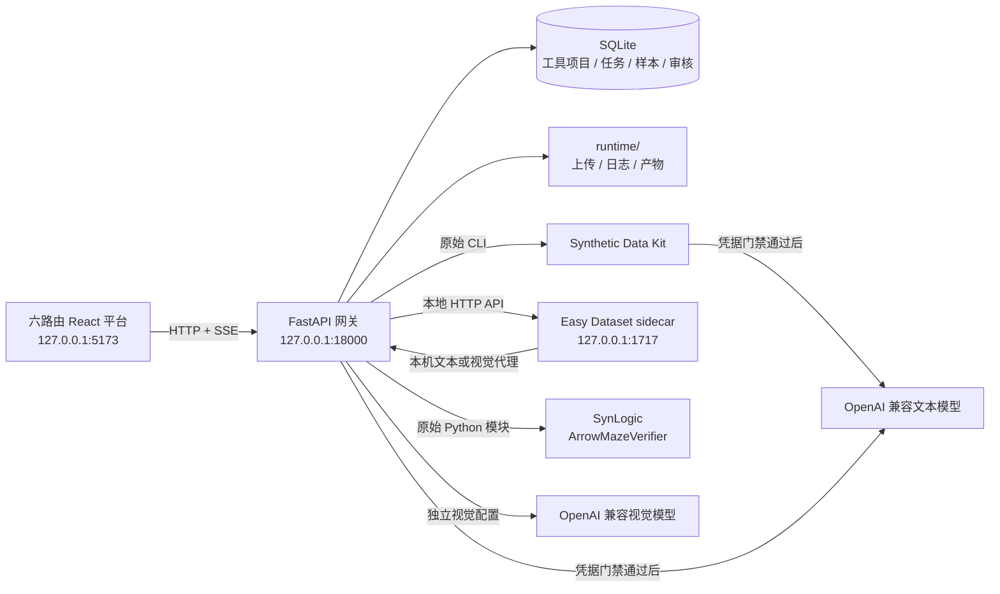

# 三工具合成数据平台 v2 架构说明

## 1. 系统边界



网页只能引用当前工具项目中已经上传的 `asset_id`。本机真实路径、API Key、Authorization 和代理 Token 都不会由前端提交。

## 2. 前端信息架构

前端是六个真实路由，不是一个 626 行单页 Dashboard：

| 路由 | 用途 |
|---|---|
| `/` | 三个工具的入口、连接状态和最近项目 |
| `/synthetic` | Synthetic 的上传、五种生成模式、预览、审核和导出 |
| `/easy-dataset` | Easy Dataset 的四种工作流 |
| `/synlogic` | Arrow Maze 参数、网格、验证与导出 |
| `/tasks` | 已完成产物与需要处理的任务 |
| `/settings` | 文本模型、视觉模型和本地组件诊断 |

样式使用 220px 浅色侧栏、白色主体、系统中文字体和标准表单。任务进度是独立阶段行，不绘制竖向 Timeline 或装饰性连接线。

## 3. 工具项目隔离

项目增加 `tool_id`：

```text
synthetic-data-kit
easy-dataset
synlogic
legacy
```

- 展示名称只在同一工具内唯一。
- 内部名称保持全局唯一，兼容旧数据库约束。
- 创建任务时再次校验项目类型和工具类型。
- 文件、任务、事件、样本、审核与导出都按项目 ID 隔离。
- 旧项目迁移为 `legacy`，不删除数据库或产物。

三个工具最后打开的项目分别保存在浏览器本地状态。页面切换后会主动清空旧任务状态，再从当前项目 API 恢复最近结果。

## 4. v2 页面工作流 API

前端主要使用：

```text
GET    /api/v2/catalog
GET    /api/v2/tools/{tool_id}/projects
POST   /api/v2/tools/{tool_id}/projects
PATCH  /api/v2/projects/{project_id}
POST   /api/v2/projects/{project_id}/assets
GET    /api/v2/projects/{project_id}/assets
POST   /api/v2/synthetic/projects/{project_id}/jobs
POST   /api/v2/easy-dataset/projects/{project_id}/jobs
POST   /api/v2/synlogic/projects/{project_id}/jobs
GET    /api/v2/jobs
GET    /api/v2/jobs/{job_id}
GET    /api/v2/jobs/{job_id}/events
GET    /api/v2/jobs/{job_id}/samples
POST   /api/v2/jobs/{job_id}/export
GET    /api/v2/integrations/status
POST   /api/v2/integrations/{profile}/probe
```

旧 `/api/v1` 仍保留兼容。v2 页面只提交高层工作流参数，网关在内部调用 Agent OS 原子工具。例如一次 Synthetic CoT 任务内部完成 `ingest → create → curate → save-as`。

## 5. Agent OS 兼容层

`gateway/app/contracts.py` 实现：

- `ToolTier`
- `RiskLevel`
- `BehaviorHints`
- `ExecutionContext`
- `ToolDefinition`
- `ToolResult`
- `SafetyPolicy`
- `ScenarioMode`
- `ToolRegistry`

工具池装配按“收集、场景过滤、安全检查、MCP 扩展、Tier 去重”五步执行。MCP 入口本期为空，但未来扩展也必须经过同一安全策略。

对外保留八个原子工具：

| 工具 | 风险 | 执行方式 |
|---|---:|---|
| `synthetic_ingest` | medium | 原始 CLI `ingest` |
| `synthetic_generate_cot` | medium | CLI 完整工作流 |
| `synthetic_curate_export` | medium | CLI 格式转换 |
| `easy_dataset_ingest` | medium | sidecar 上传与分块 |
| `easy_dataset_generate` | medium | sidecar 问答生成 |
| `easy_dataset_export` | medium | 统一格式导出 |
| `synlogic_generate_arrow_maze` | medium | 原始生成器与全量验证 |
| `synlogic_verify_arrow_maze` | low | 原始验证器 |

`easy_dataset_workflow` 是网关内部页面编排工具，不在普通用户的原子工具列表中显示。

## 6. 三个适配器

### Synthetic Data Kit

- CLI 子进程拥有独立工作目录、超时和取消信号。
- 密钥只通过子进程环境变量注入。
- 检查退出码、鉴权错误文本、产物存在性、JSON 可解析性和有效数量。
- 输出保留原始文件、统一样本、工具 commit、配置哈希和阶段日志。

### Easy Dataset

- 上游源码与界面保持未修改。
- 文本模型配置指向 `http://127.0.0.1:18000/internal/llm/v1`。
- 视觉模型配置指向 `http://127.0.0.1:18000/internal/vision/v1`。
- sidecar 只保存无敏感性的占位 token；真实密钥只在网关进程环境中。
- 文档问答、蒸馏、评估和图片工作流都使用上游 HTTP API。
- 图片工作流通过上游 PDF 转图片、ZIP 导入、图片问题和图片数据集接口装配。

### SynLogic

- 直接导入固定 commit 的 Arrow Maze 模块。
- 每条生成结果都交给原始 `ArrowMazeVerifier`。
- 网页答案先按二维 JSON 数组严格解析、重新序列化，再传给验证器。
- 保存上游原始 JSONL、平台统一样本、全量通过率和破坏样本结果。

## 7. 持久化、事件与导出

SQLite 保存项目、资产、任务参数、阶段状态、SSE 事件、样本、审核状态、工具 commit、模型与配置哈希。文件保存在：

```text
runtime/uploads/<project_id>/
runtime/runs/<project_id>/<job_id>/
runtime/exports/<project_id>/<job_id>/
```

一个任务最多一个模型执行槽；无模型任务最多两个并发。任务切换时 SSE 订阅和旧页面状态都会清空。

JSON、JSONL、CSV、Alpaca、OpenAI FT、ChatML 和 Hugging Face 导出在返回前做解析校验。

## 8. 凭据与诊断

文本模型状态区分：

```text
not-configured
rotation-unconfirmed
ready-to-probe
verified
invalid-credential
quota-or-rate-limit
model-not-found
network-unreachable
```

有环境变量不等于密钥有效。只有设置页最小请求成功后，当前网关进程才把状态标为 `verified`。Synthetic 和 Easy Dataset 文本页面据此启用生成。

视觉模型使用独立配置。无视觉配置时图片与多模态按钮禁用；现有环境尚未完成视觉端到端实测。

## 9. 当前边界

- 本机、内部、单用户，无登录和团队权限。
- 不部署公网 Sites。
- 不修改 Easy Dataset 源码。
- 不做 Playground、盲测、Hugging Face 上传、LLaMA Factory、其他 SynLogic 题型或模型训练。
- 上游接口固定在当前本机 commit；升级前必须重新运行集成测试。
